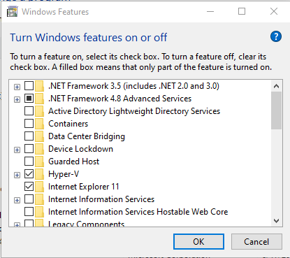
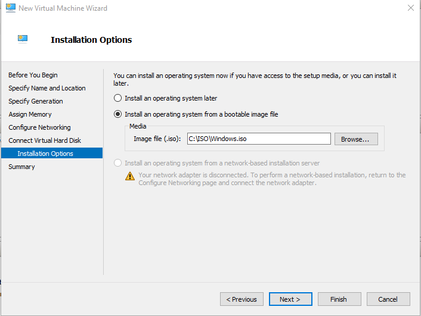
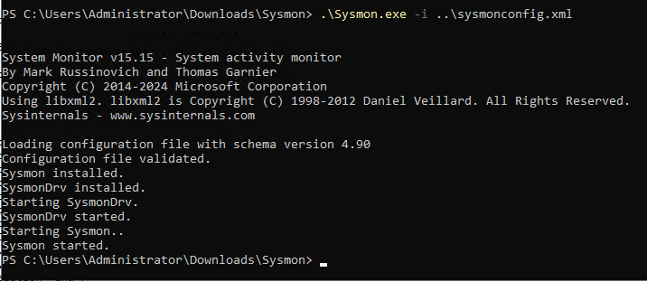
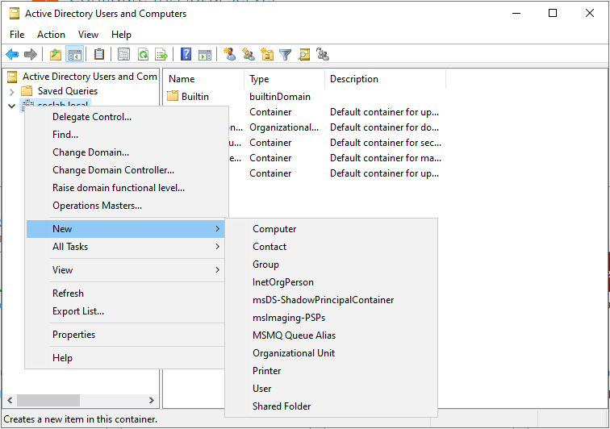
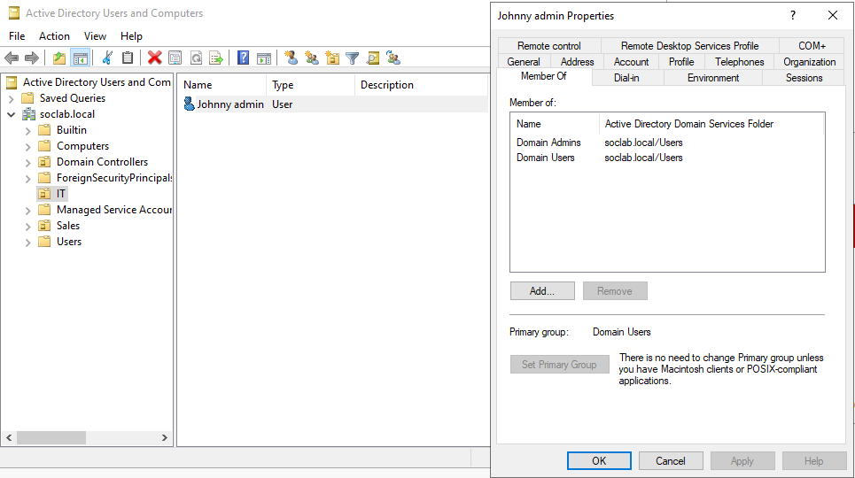

# Setting Up an On-Premises Active Directory Home Lab with Splunk

## Objective

This guide aims to create an on-premises environment consisting of an Active Directory, a domain-joined Windows 10 VM, a Splunk server for log collection, and Kali Linux VM to simulate a brute-force attack on the RDP session of the Windows 10 VM. While this guide uses **Hyper-V** for virtualization, you can also choose **VMware** or **VirtualBox** to complete this setup.

> **Important Security Disclaimer**: This lab environment is for educational purposes only. The techniques demonstrated should only be used in authorized test environments. Never attempt these techniques against systems without explicit permission.

## Network Topology

.

## Tools and Resources Required

- **Hyper-V** (or VMware/VirtualBox)
- **Splunk** (as the SIEM)
- **Kali Linux** (attacker)
- **Windows 10** (Victim machine)
- **Windows Server 2022** (Active Directory)
- **Password Manager** (Keepass, Bitwarden or similar to securely store credentials for multiple accounts)

#### Minimum VM Specifications:
- Windows Server 2022: 4GB RAM, 50GB storage
- Windows 10: 2GB RAM, 50GB storage
- Kali Linux: 2GB RAM, 20GB storage
- Ubuntu Server (Splunk): 8GB RAM, 100GB storage

> **Note**: Ensure your host system has enough resources to run all VMs simultaneously.

### 1. Download the Necessary ISO Files

Before we begin setting up the VMs, download the required ISO files and virtual hard disks and for example save them in your `C:\ISO` folder:

- [Windows Server 2022](https://www.microsoft.com/en-us/evalcenter/download-windows-server-2022)
- [Windows 10](https://www.microsoft.com/en-us/software-download/windows10)
- [Kali Linux](https://www.kali.org/get-kali/#kali-virtual-machines)
- [Ubuntu Server (optional for later setups)](https://ubuntu.com/download/server)

.

### 2. Installing Hyper-V

**Hyper-V** is a built-in hypervisor available on Windows that lets you create and manage VMs. If you don’t have it installed, follow these steps:

1. Press `Windows + R` to open the **Run** box.
2. Type `appwiz.cpl` and hit Enter to open the **Control Panel**.
3. On the left, click **Turn Windows features on or off**.
4. Scroll down and select **Hyper-V**.
5. Click **OK** and restart your computer if prompted.

.

.

### 3. Create Virtual Machines in Hyper-V

#### Windows 10 Victim VM

1. Open **Hyper-V Manager** from the Start menu.
2. Click **Action** > **New** > **Virtual Machine**.
3. Name the VM (e.g., "Victim-PC").
4. Choose **Generation 2** for the VM generation.
5. Assign at least 2048 MB (2 GB) of memory.
6. Leave the network connection as **Not Connected** for the initial setup.
7. Choose **Create a virtual hard disk** and assign at least 40 GB of storage.
8. Select **Install an operating system from a bootable image file (.iso)**.
9. Click **Browse** and select the **Windows 10** ISO file you downloaded earlier.
10. Click **Finish** to create the VM.

.

.

.

.

.

.

.

#### Windows Server 2022 VM (Active Directory)

1. Follow the same steps as creating the **Windows 10** VM.
2. Name the VM (e.g., "AD-Server").
3. Choose **Generation 2** for the VM generation.
4. Allocate at least **4096 MB (4 GB)** of memory for the VM.
5. Choose **Create a virtual hard disk** with at least **50 GB** of storage.
6. Select the **Windows Server 2022** ISO file.
7. During the installation, choose the second option: **Desktop Experience** (this includes the GUI).
8. On the first startup, set the **Administrator password**. Save it securely in your password manager to avoid losing access.

#### Kali Linux VM (Attacker)

1. Name the VM (e.g., "Kali-Attacker").
2. Choose **Generation 2** for the VM generation.
3. Allocate at least **2048 MB (2 GB)** of memory.
4. For the network connection, choose the **Default Switch** for the initial setup.
5. Instead of an ISO, **extract the Kali Linux virtual hard disk** from the download.
6. When creating the VM, choose the extracted **Kali virtual hard drive**.
7. Click **Finish** to complete the VM setup.
8. **Connect** to the VM and log in with the default credentials:
   - Username: `kali`
   - Password: `kali`
9. Open the terminal and update the system:
```bash
sudo apt-get update && apt-get upgrade -y
```

.

#### Ubuntu Server VM (Splunk Lab)

1. **Name the VM** (e.g., "Splunk").
2. Allocate at least **8192 MB (8 GB)** of memory.
3. Choose the **Default Switch** for networking for the initial setup.
4. Create a **100 GB virtual hard disk**.
5. Select the **Ubuntu Server ISO** for installation.
6. Click **Finish** to complete the VM setup.
7. **Connect** to the VM and follow the installation steps:
   - Choose **English**, then accept all default settings.
   - Set a **name**, **server name**, **username**, and **password**.
   - No need to enable SSH for this lab.
8. If prompted, **reboot**.
9. Once rebooted, update the server:
```bash
sudo apt-get update && apt-get upgrade -y
```
10. If you get a permission error, switch to root user:

```bash
sudo su
```

After updates, exit the root user:

```bash
exit
```

.

.

.

.

## Creating a NAT Virtual Switch

We'll create a Virtual Switch and configure it with NAT (Network Address Translation) so that our VMs can access the internet. You can either create the virtual switch through Hyper-V Manager and continue the NAT configuration in Powershell or set it up entirely using PowerShell.

For this guide, I will be using the **PowerShell method**.

### Create the NAT Virtual Switch in PowerShell

Run the following command in **PowerShell (Admin mode)** to create the virtual network and assign it a name:

```powershell
New-NetNat -Name "NATNetwork" -InternalIPInterfaceAddressPrefix 192.168.200.0/24
```
This command creates a NAT virtual switch with the name `NATNetwork` and uses the IP range `192.168.200.0/24`.

### Find the Network Interface Index

After creating the virtual switch, we need to find the interface index to configure the NAT gateway:

```powershell
Get-NetAdapter
```

This will display all virtual switches. Look for the adapter name you just created and locate the **ifIndex** (Interface Index).

### Assign an IP Address to the Virtual Switch

Once you have the interface index, assign an IP address to your virtual switch, which will serve as the default gateway for your VMs. For example, if the **ifIndex** is `54`, the command would be:

```powershell
New-NetIPAddress -IPAddress 192.168.200.1 -PrefixLength 24 -InterfaceIndex 54
```

- `IPAddress`: This will be the default gateway (e.g., `192.168.200.1`).
- `PrefixLength`: This represents the subnet mask (`/24` or `255.255.255.0`).
- `InterfaceIndex`: The interface index from the `Get-NetAdapter` command.

### Finalize NAT Configuration

Run the following command to set up the NAT network:

```powershell
New-NetNat -Name "NATNetwork" -InternalIPInterfaceAddressPrefix 192.168.200.0/24
```

.

### Assign the NAT Virtual Switch to VMs in Hyper-V

1. Go back to **Hyper-V Manager** and assign the virtual network you just created (the **NAT Virtual Switch**) to each of your VMs.
2. Sign into each VM and configure a static **IPv4** address so that it's within the same range as the virtual switch (e.g., `192.168.200.x`).
3. This ensures that all VMs are on the same network, allowing them to communicate with each other and access the internet through the NAT gateway.

### Configure Kali Linux Static IP

1. Right-click on the network interface in the top-right corner of your screen.
2. Click on **Edit Connections**.
3. Choose **Wired Connection 1** and click on the gear icon.
4. Navigate to the **IPv4** tab.
5. In the **Method** section, select **Manual**.
6. Click on **Add** and input the IP address.
7. Set the network mask to **24**.
8. Input the default gateway you configured when setting up the virtual switch.
9. In the **DNS Server** field, enter Google's DNS IP: `8.8.8.8`.
10. Press **Save**.

.

### Configure Ubuntu Server Static IP

To configure a static IP address on Ubuntu server we need to configure the yaml file that is stored in the '/etc/netplan' directory. First let's navigate to that directory.
```bash
cd /etc/netplan
```
This is where you'll find YAML files that control your network configuration. These files usually have a `.yaml` extension, and their names may vary depending on your installation.
To find the network configuration file you need to list all files, use the `ls` command.

```bash
ls -la
```

- **ls**: Lists files and directories.
- **-l**: Shows detailed info (permissions, owner, size).
- **-a**: Includes hidden files (files starting with .).

```yaml
network:
  version: 2
  ethernets:
    eth0:
      dhcp4: no
      addresses: [192.168.200.20/24]
      nameservers: 
        addresses: [8.8.8.8]
      routes:
        - to: default
          via: 192.168.200.1
```
- **`eth0`**: This is the name of the network interface. Make sure to replace this with your actual interface name if it's different. You can find the interface name using the `ip addr` command.
- **`dhcp4: no`**: Disables DHCP, so the system won't try to automatically assign an IP address.
- **`addresses`**: This sets the static IP and subnet mask. In this example, the IP is `192.168.200.20` with a subnet of `/24` (which translates to `255.255.255.0`).
- **`nameservers`**: This sets the DNS server. In this example, we’re using Google’s DNS (`8.8.8.8`).
- **`routes`**: This defines the default gateway for the network (`192.168.200.1`).

> **Tip**: Be careful with indentation. This YAML file require tabs, not spaces, for indentation.

.

.

## Installing Splunk on Ubuntu Server

1. Download Splunk package using wget:
   ```bash
   wget -O splunk.deb "https://download.splunk.com/products/splunk/releases/9.3.1/linux/splunk-9.3.1-0b8d769cb912-linux-2.6-amd64.deb"
   ```
   
.

2. Install Splunk:
   ```bash
   sudo dpkg -i splunk-9.3.1-0b8d769cb912-linux-2.6-amd64.deb
   ```

.

3. Navigate to Splunk Directory and List All Files.
4. ```bash
   cd /opt/splunk
   ls -l
   ```
These commands will show you the user and group associated with the Splunk files, confirming that Splunk has only the necessary privileges.

.

3. Start Splunk and enable boot-start:
   ```bash
   sudo /opt/splunk/bin/splunk start
   sudo /opt/splunk/bin/splunk enable boot-start -user splunk
   ```

.

.

## Setting Static IP Addresses for Windows Target VM and Windows Server

### 1. Open Network Connections
- Right-click on the **Windows icon** at the bottom left corner of your screen.
- Click on **Run**.
- Type `ncpa.cpl` and press **Enter**.

.

### 2. Configure Network Adapter
- Right-click on the **network adapter** and select **Properties**.
- Click on **Internet Protocol Version 4 (TCP/IPv4)** and then click on **Properties**.

.

### 3. Set Static IP Address for Windows Target VM
- Select **Use the following IP address**:
  - **IP address**: Set an IP address within the virtual switch range you created, e.g., `192.168.200.10`
  - **Subnet mask**: `255.255.255.0` (/24)
  - **Default gateway**: The gateway IP set when you created the virtual switch, e.g., `192.168.200.1`
- Set DNS server addresses:
  - **Preferred DNS server**: `192.168.200.100` (This is the Windows Server IP, for domain joining)
  - **Alternate DNS server**: `8.8.8.8` (Google DNS)
- Click **OK** to save the settings.

.

### 4. Set Static IP Address for Windows Server VM
- Follow the same steps as above.
- Assign the following IP settings:
  - **IP address**: Set an IP address within the virtual switch range, e.g., `192.168.200.100`
  - **Subnet mask**: `255.255.255.0` (/24)
  - **Default gateway**: `192.168.200.1` (same as the target VM)
- Set DNS server addresses:
  - **Preferred DNS server**: `192.168.200.100` (The server's own IP)
- Click **OK** to save the settings.

.

### 5. Verify Configuration
- After setting the static IPs, open a command prompt and ping a website (e.g., `ping google.com`) to check if the internet connection is working.
- Ping from the Windows target VM to the Windows server to ensure they can communicate. Note that by default, ping may be disabled on the Windows target VM.

.

## Installing Sysmon and Splunk Forwarder on Windows 10 and Windows Server

### Install Splunk Universal Forwarder
1. **Download Splunk Universal Forwarder**:
   - Go to [splunk.com](https://www.splunk.com) and sign in with the account you created earlier.
   - Navigate to **Products > Free Trials and Downloads**.
   - Scroll down to **Universal Forwarder** and click on **Get my free download**.
   - Choose the **Windows 64-bit** version.

.

2. **Run the Installer**:
   - Once the download is complete, run the installer.
   - Check the box to accept the license agreement and choose **On-Premises Splunk**.
   - Enter a username (e.g., `admin`) and click on **Generate random password**.
   - For **Deployment Server**, leave it blank as we don’t have one for this lab.
   - For **Receiving Indexer**, enter the IP address of your Ubuntu Splunk VM with the default port `9997`.
   - Click on **Install** to complete the setup.
  
.

.

.

.

.

### Install Sysmon
1. **Download Sysmon**:
   - Go to the [Sysinternals website](https://learn.microsoft.com/en-us/sysinternals/downloads/sysmon) and download Sysmon.

2. **Download Sysmon Config File**:
   - Get the Sysmon config XML file from [OLAF GitHub](https://github.com/olafhartong/sysmon-modular).
   - Scroll down and select `sysmonconfig.xml`.
   - Click on **Raw**, right-click, select **Save as**, and download it into your download folder.

.

.

3. **Extract and Install Sysmon**:
   - Extract the Sysmon zip file first.
   - Run PowerShell as an administrator and change to the actual download directory path:
     ```powershell
     cd path\to\download\directory
     ```
   - Run the following command to install Sysmon with the config file:
     ```powershell
     .\Sysmon64.exe -i ..\sysmonconfig.xml
     ```
   - Note: The `..\sysmonconfig.xml` indicates that the config file is in the parent directory, not the same folder as the extracted `Sysmon64.exe` file.

.

.


### Configure Splunk Forwarder on VM's
1. **Modify Inputs.conf File**:
   - Navigate to `C:\Program Files\SplunkUniversalForwarder\etc\system\default`.
   - Copy the `inputs.conf` file to the local directory: `C:\Program Files\SplunkUniversalForwarder\etc\system\local`.

.

.

2. **Edit Inputs.conf File**:
   - Open Notepad as an administrator.
   - Open the `inputs.conf` file in the local directory.
   - Erase everything and paste the following configuration:
     ```plaintext
     [WinEventLog://Application]
     index = endpoint
     disabled = false
     [WinEventLog://Security]
     index = endpoint
     disabled = false
     [WinEventLog://System]
     index = endpoint
     disabled = false
     [WinEventLog://Microsoft-Windows-Sysmon/Operational]
     index = endpoint
     disabled = false
     renderXml = true
     source = XmlWinEventLog:Microsoft-Windows-Sysmon/Operational
     ```

.

3. **Save the File:**
   - Save the file.
   - Change the log on for the Splunk Forwarder service to the **Local System account**:
     - Open **Services** (`services.msc`).
     - Find **SplunkForwarder** in the list, right-click, and select **Properties**.
     - Go to the **Log On** tab and choose **Local System account**.
     - Click **Apply** and **OK**.
   - Restart the Splunk Universal Forwarder service for the changes to take effect.

.

.

### Configuring Splunk to Receive Data from Forwarders

#### 1. Sign into the Splunk Web Portal
- Open your web browser and navigate to the IP address of your Splunk server with port 8000:
  ```plaintext
  https://192.168.200.20:8000
  ```
.

#### 2: Create the "endpoint" Index

When we set up the Splunk forwarder on our two VM's (Windows 10 victim and Windows server) , we configured them to use the `index = endpoints`. By default, this index does not exist in Splunk, so we need to create it.

1. Click on **Settings** in the top-right corner of the Splunk web portal.
2. Under the **Data** section, click on **Indexes**.
3. On the **Indexes** page, click on the **New Index** button.
4. In the **Index Name** field, type `endpoint`.
5. Click on **Save** to create the new index.

.

.

.

#### 3: Enable Splunk Server to Receive Data

Since we chose port **9997** when we setup Splunk forwarder on our 2 VMs, you need to configure the Splunk server to listen on the default port **9997**.

1. Go to **Settings** in the top-right corner.
2. Under the **Data** section, click on **Forwarding and Receiving**.
3. Click on **Configure Receiving**.
4. On the receiving configuration page, click on **New Receiving Port** in the top-right corner.
5. Enter **9997** as the port number and click on **Save**.

.

.

#### 4: Verify Data is Coming In

Once everything is set up correctly, you should start seeing data from your endpoints being sent to the Splunk server.

1. Click on **Apps** in the top-left corner and select **Search & Reporting**.
2. In the search bar at the top, type:

```plaintext
index=endpoints
 ```
3. Ensure that the time frame is correctly set in the time picker on the right-hand side of the screen (default is 24 hours).
4. Press **Enter** to search for incoming data. If everything is working correctly, you should see logs from your endpoints.

.

## Promoting Windows Server to Domain Controller

### Install Active Directory Domain Services (ADDS)

1. **Open Server Manager:**
   - Launch the **Server Manager** on your Windows Server.

2. **Add Roles and Features:**
   - Click on **Manage** in the top-right corner and select **Add Roles and Features**.
   - In the **Add Roles and Features Wizard**, select **Role-based or feature-based installation** and click **Next**.

.

3. **Select Your Server:**
   - Choose your server from the server pool and click **Next**.

4. **Select ADDS Role:**
   - In the **Select Server Roles** window, check the box for **Active Directory Domain Services (ADDS)**.
   - A popup will appear asking you to add features that are required for ADDS. Click **Add Features**, then click **Next**.

.

5. **Leave Defaults and Install:**
   - For the remaining options, leave the defaults and click **Next** until you reach the **Install** button.
   - Click **Install** to begin the installation process.

.

### Promote the Server to a Domain Controller

1. **Flag Icon Notification:**
   - After the ADDS role is installed, a flag icon will appear beside **Manage** in the Server Manager.
   - Click on the flag and then click on **Promote this server to a domain controller**.

.

2. **Add a New Forest:**
   - In the **Deployment Configuration** window, select **Add a new forest**.
   - Provide a root domain name, for example: `soclab.local`.

3. **Set Domain Controller Options:**
   - Set a password for the Directory Services Restore Mode (DSRM).
   - Leave the default options for the rest and click **Next**.

4. **Review and Install:**
   - Continue clicking **Next** through the remaining default settings until you reach the **Install** button.
   - After installation, the server will automatically restart.

### Step 3: Create Organizational Units (OUs) and Users

1. **Sign in with Domain Account:**
   - After the server restarts, sign in using your domain credentials. You will see the domain name (e.g., `soclab.local`) before the username.

2. **Open Active Directory Users and Computers (ADUC):**
   - In **Server Manager**, click on **Tools** in the top-right menu.
   - From the dropdown, select **Active Directory Users and Computers (ADUC)**.

.

3. **Create Organizational Units (OUs):**
   - In ADUC, right-click on your domain (e.g., `soclab.local`) and select **New > Organizational Unit**.
   - Create two OUs, for example: `IT` and `Sales`.

.

4. **Create Users:**
   - Right-click on the **Sales** OU and select **New > User**.
   - Create a user with the following details:
     - First name: Val
     - Last name: Blue
     - User logon name: vblue
     - Assign a password that meets complexity requirements
     > **Note**: Store this password securely in your password manager

   - Right-click on the **IT** OU and select **New > User**.
   - Create another user with the following details:
     - First name: Johnny
     - Last name: Admin
     - User logon name: jadmin
     - Assign a strong password
     > **Note**: Store this password securely in your password manager

.

5. **Add Johnny to Domain Admins Group:**
   - After creating **Johnny** in the **IT** OU, right-click on the user, select **Properties**, and go to the **Member Of** tab.
   - Click on **Add**, type `Domain Admins`, and add **Johnny** to the **Domain Admins** group.
   - This will allow Johnny account to be used to join computers to the domain.

.

## Joining Windows 10 VM to Domain

### Open System Settings

1. **Sign into the Windows 10 VM:**
   - Sign into the Windows 10 VM

2. **Access System Settings:**
   - Right-click on the **Windows icon** (Start menu) at the bottom-left corner of the screen.
   - In the pop-up menu, click on **System**.

.

3. **Advanced System Settings:**
   - In the **System** window, click on **Advanced system settings** on the right-hand side.

.

4. **Computer Name Tab:**
   - In the **Advanced System Properties** window, go to the **Computer Name** tab.
   - Click on **Change** to modify the domain settings.

.

5. **Select Domain:**
   - Enter the domain name you created earlier (e.g., `soclab.local`) and click **OK**.

.

6. **Enter Domain Credentials:**
   - A pop-up window will appear, asking for credentials to join the domain.
   - Enter the credentials of an account that has permission to join the domain, such as **Johnny's** account, which we previously added to the **Domain Admins** group.
     - Username: `jadmin`
     - Password: `Johnny's password`

.

7. **Welcome Message:**
   - If the credentials are correct, you will see a message saying **"Welcome to the soclab.local domain"**.

.

8. **Restart the Computer:**
   - Click **OK** on the confirmation dialog and restart the computer to apply the changes.

.

### Sign in with Domain User

1. **Sign in after Restart:**
   - After the computer restarts, you will see the login screen.
   - Click on **Other user** to sign in with a domain account. You will notice the domain name listed under **"Sign in to:"**, which should show `SOCLAB` (or whatever domain name you created).
   - Enter the credentials for the **Val** user we created earlier:
     - Username: `vblue`
     - Password: `Val's password`

.

2. **Successful Domain Login:**
   - Once logged in, you will be authenticated as a domain user, and you are now part of the domain.

.

## Brute Force Attack Simulation with Kali Linux

### Enable Remote Desktop on Windows 10 VM

1. **Go to Settings:**
   - On your Windows 10 VM, go to **Settings** > **System** > **Remote Desktop**.

2. **Enable Remote Desktop:**
   - Toggle the switch to **Enable Remote Desktop** to allow remote connections to the Windows 10 VM.
   - Click on **Select users that can remotely access this PC**.
   - Click on **Add** and enter the username `vblue`.
   - Click on **Check Names** to ensure the name is recognized.
   - Click **OK** to add the user.

.

.

### Install Crowbar on Kali Linux

1. **Install Crowbar:**
   - Open a terminal in Kali Linux and install the crowbar tool using the following command:

   ```bash
   sudo apt-get install -y crowbar
   ```

2. **Confirm Installation:**
   - After installation, you can confirm it's ready to use by typing:

   ```bash
   crowbar -h
   ```

   This will display the help menu, which shows various options and usage instructions.

### Prepare Wordlist for the Attack

1. **Navigate to Wordlists Directory:**
   - Kali Linux includes a popular wordlist called **rockyou.txt**. To access it, navigate to the wordlist directory:

   ```bash
   cd /usr/share/wordlists
   ```

2. **List Files in Directory:**
   - Run the `ls` command to list the contents of the wordlists directory. You should see `rockyou.txt`.

   ```bash
   ls
   ```

3. **Copy rockyou.txt to Project Directory:**
   - Copy the **rockyou.txt** wordlist to a new directory you created for this project on your Kali Linux desktop:

   ```bash
   cp rockyou.txt ~/Desktop/ad-project
   ```

   **Explanation:**
   - The `~` symbol represents your home directory, which makes it easier to reference commonly used paths, such as your desktop or other personal folders, without needing to specify the full directory path.

.

4. **Reduce the Size of Wordlist:**
   - The **rockyou.txt** file is large (~135MB). Since we don’t need the full list for this lab, we’ll extract the first 50 passwords using the `head` command:

   ```bash
   head -n 50 rockyou.txt > password.txt
   ```

   **Explanation:**
   - This command copies the first 50 lines (which contain 50 passwords) from `rockyou.txt` into a new text file called `password.txt`. By doing this, we reduce the size of the wordlist to a smaller size for this simulation, while still having a small list of passwords to attempt the RDP brute force attack.

5. **Verify the New Password File:**
   - Use the `cat` command to view the contents of the newly created `password.txt`:

   ```bash
   cat password.txt
   ```

.

### Add the User's Real Password to the List

1. **Edit the Password File:**
   - Now, we’ll simulate a scenario where a user has set a weak password. Open the `password.txt` file in a text editor and add the user’s actual password to the bottom of the list:

   ```bash
   nano password.txt
   ```

2. **Scroll to the Bottom:**
   - In the test editor, scroll to the bottom and add **Val's** real password at the end to mimic a scenario where weak, guessable passwords can be found in a wordlists.

   **Explanation:**
   - We add the real password 'V25fRYHyiksDeW' to simulate a situation where a user sets a common or weak password, which could easily be part of a large wordlist like **rockyou.txt**. In real-world attacks, attackers run much larger wordlists (thousands or even millions of entries) in an attempt to guess user passwords.

3. **Save and Exit:**
   - Press `CTRL + X`, then `Y`, and hit `Enter` to save and exit the nano editor.

.

### Brute Force the RDP with Crowbar

1. **Check Crowbar Help Menu:**
   - First, review the options and syntax for crowbar by typing:

   ```bash
   crowbar -h
   ```

2. **Run the Brute Force Attack:**
   - Now, let's use the **crowbar** tool to brute force the RDP login on the Windows 10 VM. The command will use:
     - **-b rdp**: Specifies RDP as the target protocol.
     - **-u vblue**: Username of the target user (the Sales user we created earlier).
     - **-C password.txt**: Path to the password file.
     - **-s 192.168.200.10/32**: IP address of the target Windows 10 VM.

   Run the following command:

   ```bash
   crowbar -b rdp -u vblue -C password.txt -s 192.168.200.10/32
   ```

   **Explanation:**
   - This command launches a brute force attack against the RDP service using the list of passwords in `password.txt` to try and log in as **vblue**. Since we manually added **Val's** real password to the list, we expect the attack to succeed in a shorter amount of time compared to running the entire **rockyou.txt** file.


## Analyzing Telemetry in Splunk

### Access the Splunk Web Portal

1. Open your web browser and navigate to the Splunk web portal using the IP address of the Splunk Vm we created earlier (e.g., `https://192.168.200.20:8000`).
2. Log in with your credentials.

### Set Up Your Search

1. In the search bar at the top of the Splunk interface, enter the following search query:
   ```
   index="endpoint" vblue EventCode=4625
   ```
   - Here, we're filtering for events associated with the compromised user `vblue`and **4625** (Windows Event ID), which indicates **failed logon attempt**.

2. To focus on recent activity, select the time frame to the **last 15 minutes** on the right side of the search bar.

.

### Filter by Event Code

1. Scroll down the results a bit until you find the **Event Code** section.
2. Click on the EventCode in the **INTERESTING FIELDS** on the left of your screen and select **4625**.

### Analyzing Failed Logins

- After applying the filter, you should see multiple entries indicating failed logon attempts. 
- You can identify that these are likely brute-force attempts since the attacker tried **50 passwords at the same exact time**.

.

.

### Check for Successful RDP Connections

1. Now, change the Event Code filter to **EventCode=4624**, which represents **successful logon**.
2. You should see at least one successful login that coincides with the brute-force attempts.

.

### Review Details of Successful Logins

1. Click on **Show All 70 Lines** to see the detailed logs associated with the successful login event.
2. Here we can see that the successful RDP connection originated from our Kali Linux host and its IP address.

.

## Conclusion

This setup provides a comprehensive learning environment for understanding SIEM systems, Active Directory management, and security testing methodologies using real-world tools and scenarios.

> **Security Notice**: The techniques demonstrated in this lab should never be used against production systems or without explicit authorization. This lab is designed for educational purposes only.
